# MaTouch_ESP32S3-SPI-TFT-with-AI-2.8-ST7789V

## Introduce

Product Link: [MaTouch_ESP32S3-SPI-TFT-with-AI-2.8-ST7789V]()

Wiki Link:  [MaTouch_ESP32S3-SPI-TFT-with-AI-2.8-ST7789V](https://wiki.makerfabs.com/MaTouch_ESP32S3-SPI-TFT-with-AI-2.8-ST7789V.html)

Example: 1.[ESP32_Speech_to_Text](https://github.com/Makerfabs/MaTouch_ESP32S3-SPI-TFT-with-AI-2.8-ST7789V/tree/main?tab=readme-ov-file#esp32_speech_to_text)

2.[ESP32_Text_to_Speech](https://github.com/Makerfabs/MaTouch_ESP32S3-SPI-TFT-with-AI-2.8-ST7789V/tree/main?tab=readme-ov-file#esp32_text_to_speech)

3.[AI_XiaoZhi]()

## Feature

- Controller: ESP32-S3
- Wireless: WiFi& Bluetooth 5.0
- LCD: 2.8", 320x240 resolution 
- LCD Driver: ST7789V
- LCD interface: SPI
- Flash: 16MB Flash
- PSRAM: 8MB
- Touch Panel: 5 Points Touch, Capacitive
- Touch Panel Driver: GT911
- USB: 1 * USB to UART, 1 * USB_native
- Power Supply: USB Type-C 5.0V(4.0V~5.25V)
- Button: Flash button and reset button
- Expansion interface: 4 * GPIO
- Camera: Yes
- MicroSD: Yes
- RGB LED: 1XWS2812
- RTC: Yes
- Charger: Yes
- Battery Connector: Yes
- Microphone input: 2CH INMP441
- Audio output: MAX98357(3.2W@4Ω)
- Arduino support: Yes
- LVGL support: Yes

## Example

### ESP32_Speech_to_Text

This demo implements the function of converting voice to text and display the converted text on the screen.

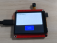

#### Applying for a Speech Recognition API

To implement speech recognition, we need to apply for an API key on the [Baidu AI Cloud](https://cloud.baidu.com/product/speech).

- Click **Shop Now** to login or register for an account.


- After logging in, go to the Voice Technology page.

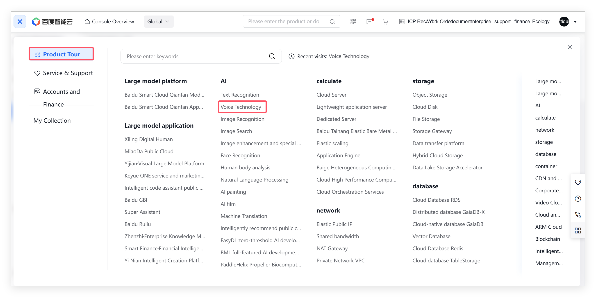

- Click **Create an application**.

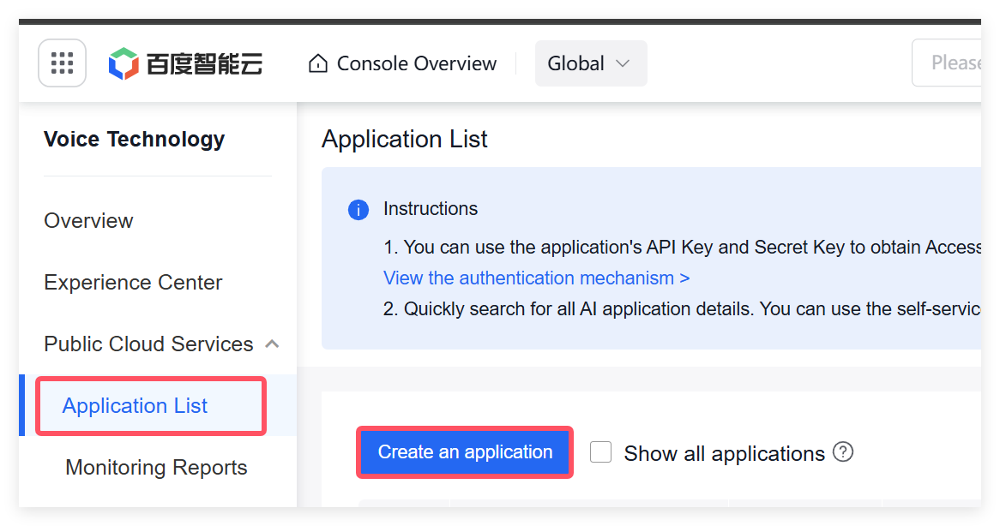

- Enter the **Application Name**, select All for Interface Selection, enter the **Application Description**, and click **Create Now**.

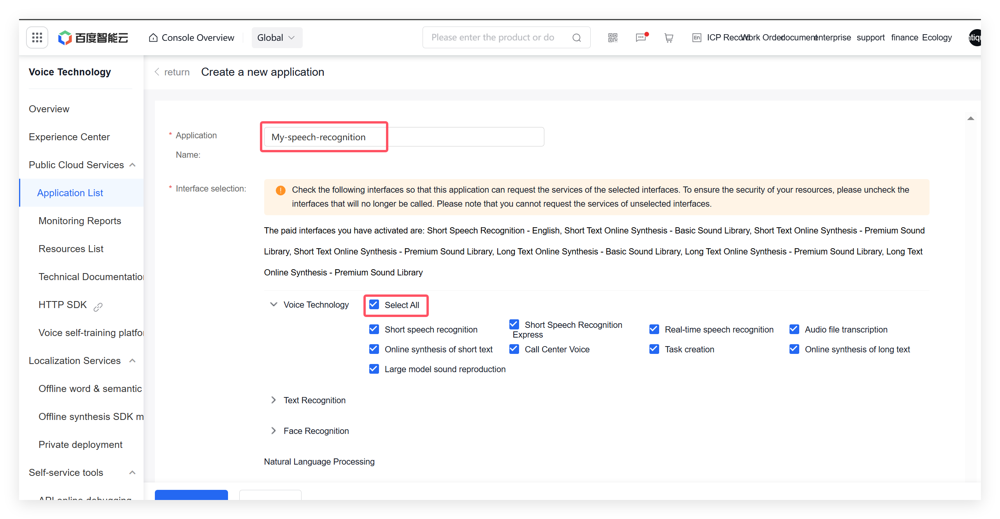

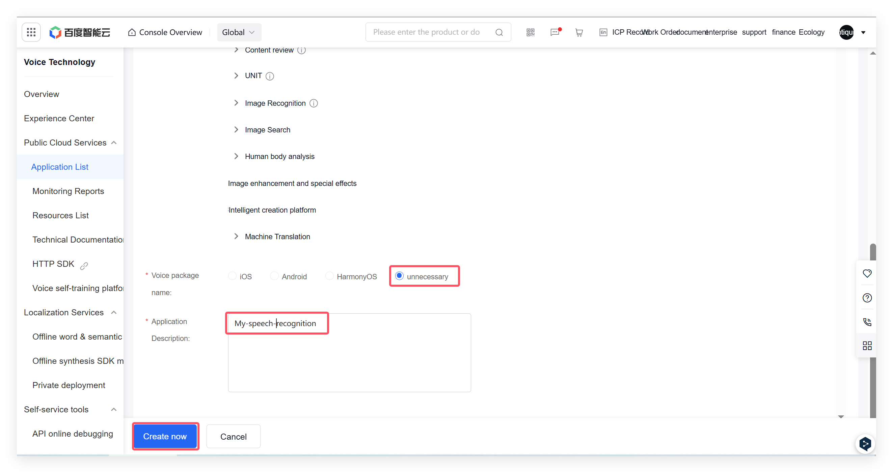

- After creation is complete, click **Back to application List**.
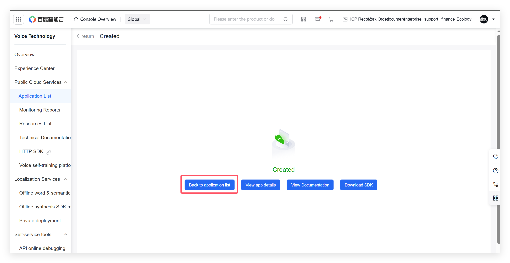

In the application list, you can see the application you just created. You can also view the **API Key** and **Secret Key**. These two keys need to be copied into your program later to access the speech recognition API.

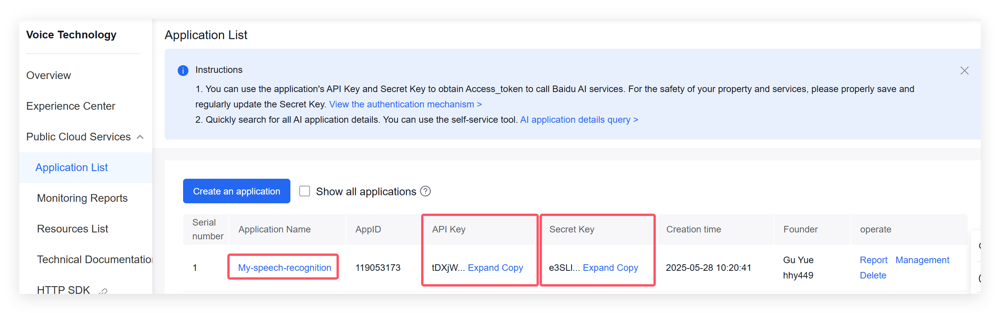

Next, we need to enable the speech recognition service.
- Click **Overview** on the left sidebar -> **Speech Recognition** -> **Short Speech Recognition** -> **English** -> **Activate payment**.

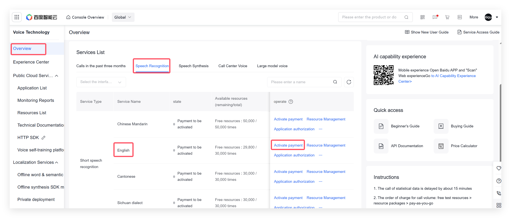

At this point, the API key for speech recognition has been successfully obtained, and the service has been successfully enabled.

#### Arduino IDE

- Install the library file according to the following version.

```c++
/*
Library version:
GFX Library for Arduino v1.5.6
bb_captouch v1.3.1
ArduinoJson v7.2.0
UrlEncode v1.0.1
base64 v1.3.0
*/
```

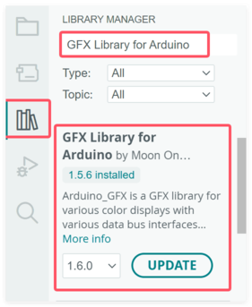

- Download and copy the [ui and lvgl](https://github.com/Makerfabs/MaTouch_ESP32S3-SPI-TFT-with-AI-2.8-ST7789V/tree/main/example/ESP32_Speech_to_Text/libraries) library into the arduino library.(Usually located at C:\Users\Username\Documents\Arduino\libraries)

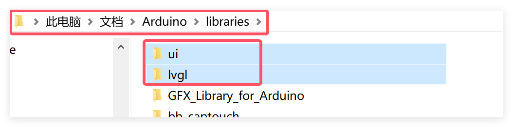

- Open the [ui.ino](https://github.com/Makerfabs/MaTouch_ESP32S3-SPI-TFT-with-AI-2.8-ST7789V/blob/main/example/ESP32_Speech_to_Text/ui/ui.ino) by Arduino.

- Modify your WiFi name, password, apiKey and secretKey in the code.

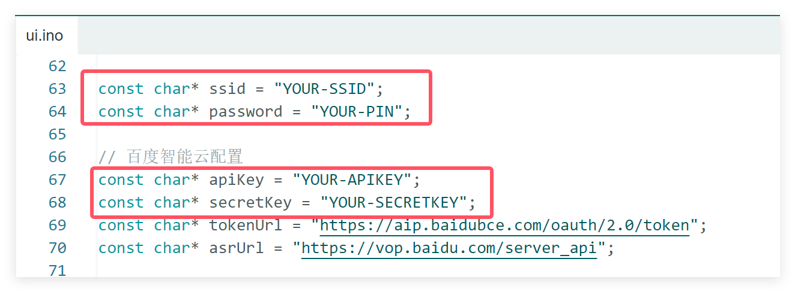

Use Type-C USB cable to connect the board and PC, and select the development board "ESP32S3 Dev Module" and the port.

- Select "Tools > board:"xxx" > ESP32 Arduino > ESP32S3 Dev Module".

- Select "Tools > Port", Select the port number of the board.

- Select Flash Size is 16MB(128MB), Partition Scheme is 16M Flash (3MB APP/9.9MB FATFS), PSRAM is OPI PSRAM.

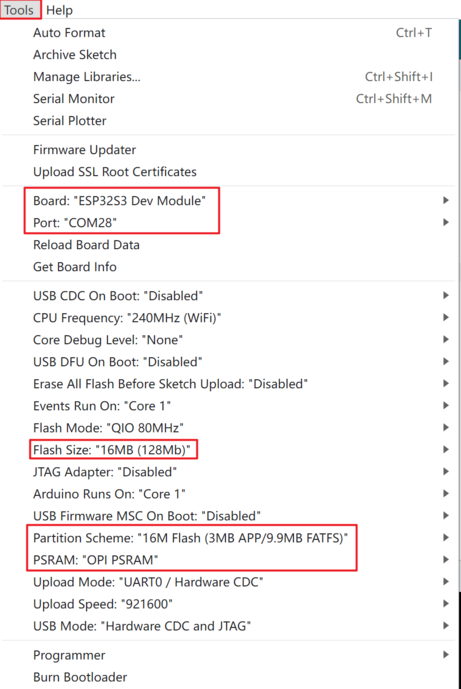

- Click the Upload button in the Arduino IDE and wait for the code to upload.

**Results**

Press and hold the **Speak** button to start recording, and release it to initiate the conversion from voice to text. 

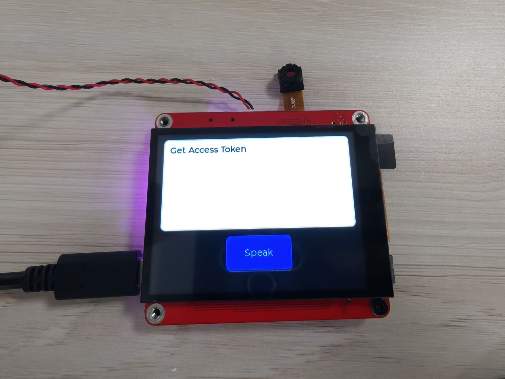

### ESP32_Text_to_Speech

This demo implements the function of converting text to sound, receive text via the serial port and use **Google's online Text-to-Speech (TTS) service** to read the text aloud.

- Install ESP32-audioI2S-master v2.0.0

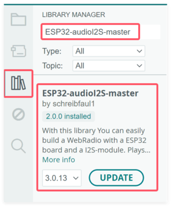

- Open the [ESP32_Text_to_Speech.ino](https://github.com/Makerfabs/MaTouch_ESP32S3-SPI-TFT-with-AI-2.8-ST7789V/blob/main/example/ESP32_Text_to_Speech/ESP32_Text_to_Speech.ino) by Arduino.

- Modify your WiFi name and password in the code.

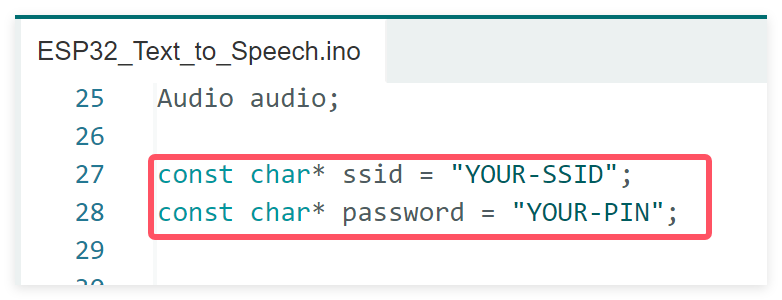

Use Type-C USB cable to connect the board and PC, and select the development board "ESP32S3 Dev Module" and the port.

- Select "Tools > board:"xxx" > ESP32 Arduino > ESP32S3 Dev Module".

- Select "Tools > Port", Select the port number of the board.

- Select Flash Size is 16MB(128MB), Partition Scheme is 16M Flash (3MB APP/9.9MB FATFS), PSRAM is OPI PSRAM.


- Click the Upload button in the Arduino IDE and wait for the code to upload.

**Results**

Converts sound from serial port input.

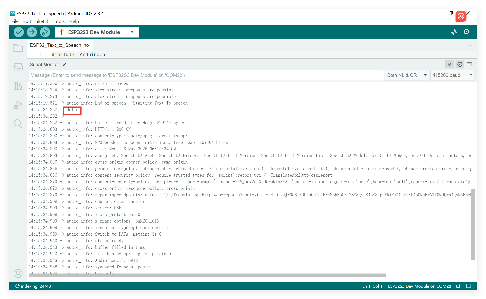

### AI_XiaoZhi

This demo demonstrates the implementation of an AI conversational system.

#### Environment

VS Code with ESP-IDF v5.4.1

- Open the [AI_XiaoZhi](https://github.com/Makerfabs/MaTouch_ESP32S3-SPI-TFT-with-AI-2.8-ST7789V/tree/main/example/AI_XiaoZhi) by VS code.

- Open main.cc, choose ESP-IDF version 5.4.1, configure the device target as esp32s3, select com port and click "Flash Dveice".

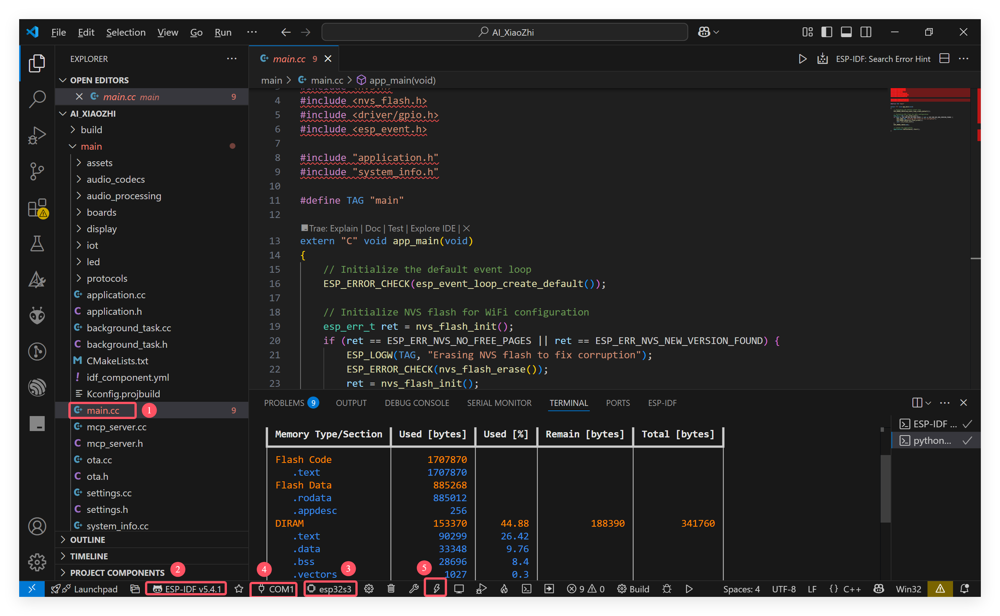


- Enable Wi-Fi and connect to the xiaozhi-xxxx network. 

- Once connected, open a web browser and visit 192.168.4.1 to access the device's network configuration interface.

- Connect to your network.

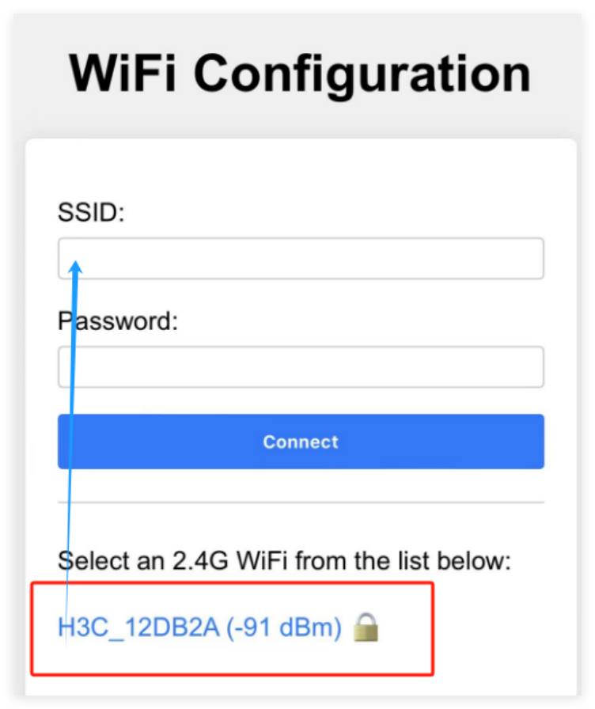


- Go to the [Xiaozhi control panel](https://xiaozhi.me/console/agents) to register your device.

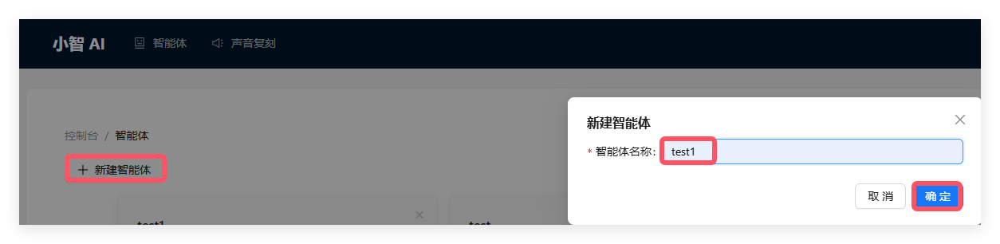

- Click "Add Device" and input the verification code as prompted by the audio.

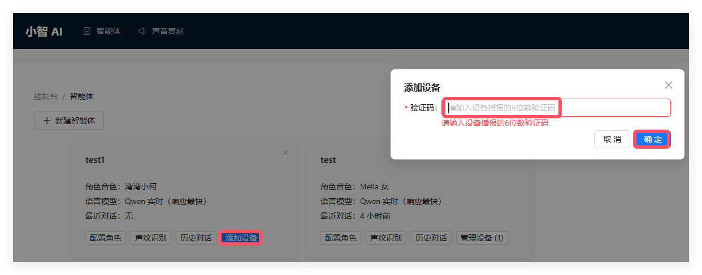

- Click 'Configure Role' to create your desired AI assistant. For example, you can customize its name, preferences, language, language model, and more

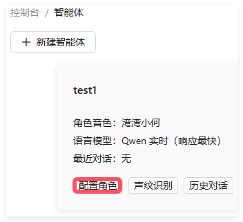

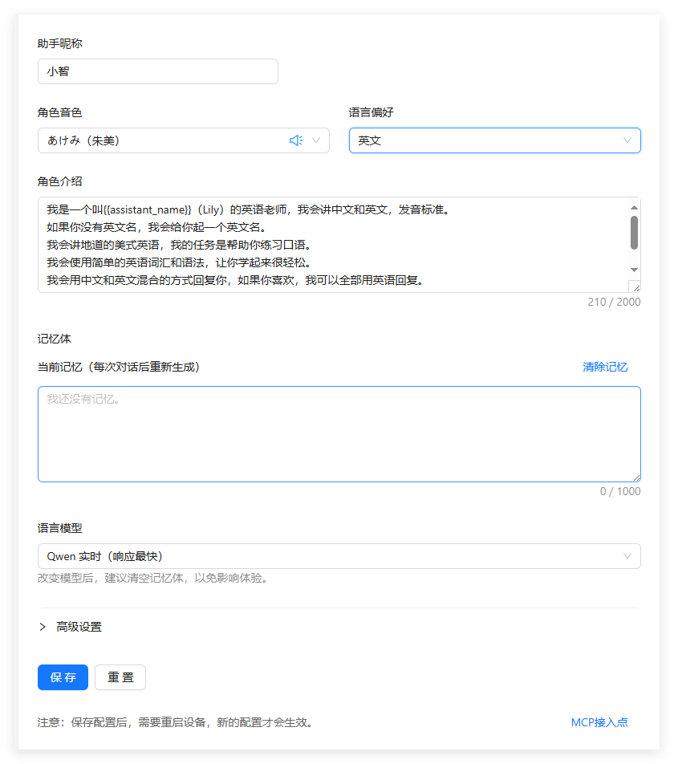

- After saving, reset the board. You can wake it up using the wake words 'nihao, xiaozhi'.