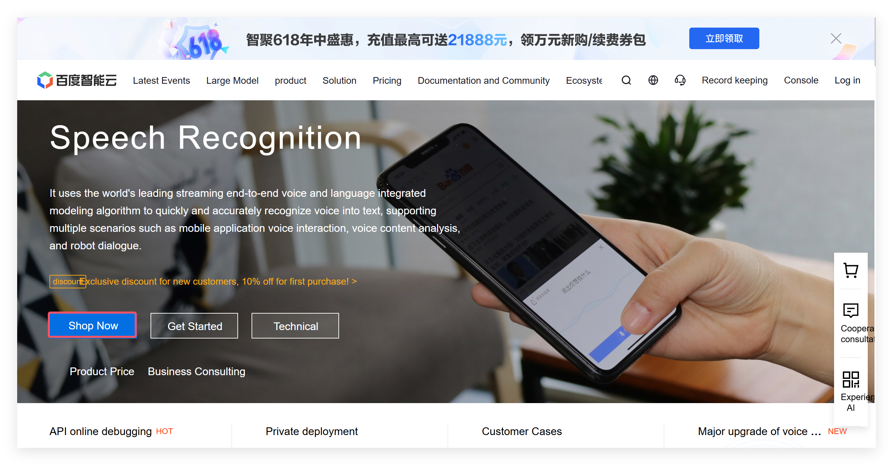

# MaTouch_ESP32S3-SPI-TFT-with-AI-2.8-ST7789V

## Introduce

Product Link: [MaTouch_ESP32S3-SPI-TFT-with-AI-2.8-ST7789V]()

Wiki Link:  [MaTouch_ESP32S3-SPI-TFT-with-AI-2.8-ST7789V](https://wiki.makerfabs.com/MaTouch_ESP32S3-SPI-TFT-with-AI-2.8-ST7789V.html)

## Feature

- Controller: ESP32-S3
- Wireless: WiFi& Bluetooth 5.0
- LCD: 2.8", 320x240 resolution, driver ST7789V
- LCD interface:16bit
- Flash:16MB Flash
- PSRAM:8MB
- Touch Panel: 5 Points Touch, Capacitive
- Touch Panel Driver: GT911
- USB: 1 * USB to UART, 1 * USB_native
- Power Supply: USB Type-C 5.0V(4.0V~5.25V)
- Button: Flash button and reset button
- Expansion interface: 4 * GPIO
- MicroSD: Yes
- RTC: Yes
- Microphone input (INMP441)
- Audio output (MAX98357A/MAX98357B)

## Example

### ESP32_Speech_to_Text

This demo implements the function of converting voice to text and display the converted text on the screen. Press and hold the "Speak" button to start recording, and release it to initiate the conversion from voice to text. 

#### Applying for a Speech Recognition API

To implement speech recognition, we need to apply for an API key on the [Baidu AI Cloud](https://cloud.baidu.com/product/speech).

- Click **Shop Now** to login or register for an account.

- After logging in, go to the Voice Technology page.

- Click **Create an application**.

- Enter the **Application Name**, select All for Interface Selection, enter the **Application Description**, and click **Create Now**.

- After creation is complete, click **Back to application List**.

In the application list, you can see the application you just created.You can also view the **API Key** and **Secret Key**. These two keys need to be copied into your program later to access the speech recognition API.

Next, we need to enable the speech recognition service.
- Click **Overview** on the left sidebar -> **Speech Recognition** -> **Short Speech Recognition** -> **English** -> **Activate payment**.

At this point, the API key for speech recognition has been successfully obtained, and the service has been successfully enabled.

#### Arduino IDE

### ESP32_Speech_to_Text

